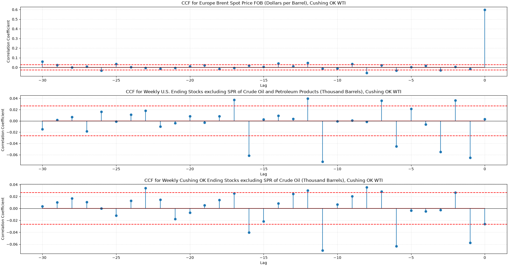
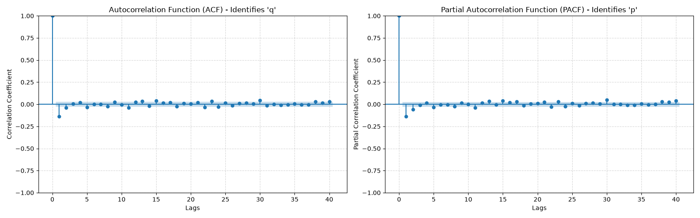

    WTI crude oil spot price forecasting

	exogenous variables:

Cushing and US crude oil inventories - typically have strong negative correlation to prices, tight supply can prompt futures prices to rise and surplus can crash prices (see 2020 pandemic)
Brent crude spot price - slightly heavier and sourer crude oil than WTI crude but still classified as a light, sweet crude oil like WTI (premium grade), large change in their spread affects demand accordingly, keeping them in line
OPEC production quotas - OPEC produced ~32% of the world's crude oil this year and aim to stabilise fluctuations in oil prices, typically announcements of production quotas have an inverse relation to crude oil prices

	exploratory data analysis:

data was sampled from 2011-2026, 0% of data missing

WTI Crude Oil Spot Price - daily history (Cushing_OK_WTI_Spot_Price_FOB):
data is indexed by business days (no weekends)
spot prices mostly driven by geopolitical events and supply-demand imbalances
additive seasonal decomposition - annual seasonal strength of 0.2076 (fairly low, expected), not significant

Brent Crude Oil Spot Price - daily history (Cushing_OK_WTI_Spot_Price_FOB):
annual seasonal strength of 0.1026, lower than WTI due to being globally traded with more international demand - less affected by localized factors such as weather patterns

US Ending Stocks of Crude Oil and Petroleum Products (excl. SPR) - weekly history
commercial crude oil inventories better reflect immediate supply and demand for refineries, government SPR stock only moves to stabilise prices in response to emergencies
annual seasonal strength 0.3733, basic wave pattern rather than M-shape

US Gross Inputs to Refineries - monthly history
annual seasonal strength 0.3596 ('M-shaped cycle')

Cushing Ending Stocks of Crude Oil (excl. SPR) - weekly history
annual seasonal strength 0.0396 (very low, no significant seasonality)

all datasets were extrapolated to business days using ffill

	forecasting:

WTI spot price tested for stationarity via ADF testing: 

	ADF statistic: -3.2720
	p-value:       0.0162
	critical value (5%): -2.8621

other variables: Europe Brent Spot Price FOB (Dollars per Barrel) - 0.0136, Weekly U.S. Ending Stocks excluding SPR of Crude Oil and Petroleum Products (Thousand Barrels) - 0.3814, Weekly Cushing OK Ending Stocks excluding SPR of Crude Oil (Thousand Barrels) - 0.0595 
some series not stationary, differencing all series to avoid spurious regression

data normalised by StandardScaling (linear scaling with 0 mean and 1 variance)

VIF check to confirm acceptable levels of multicollinearity 

	Weekly U.S. Ending Stocks excluding SPR of Crude Oil and Petroleum Products (Thousand Barrels) | VIF:   1.72 | safe
	Weekly Cushing OK Ending Stocks excluding SPR of Crude Oil (Thousand Barrels) | VIF:   1.52 | safe
	Europe Brent Spot Price FOB (Dollars per Barrel) | VIF:   1.36 | safe

CCF plots to determine lags (8, 11, 11)

ARIMAX-GARCH model:
heteroskedasticity: p(H) = 0.00, GARCH suitable for heteroskedastic time series 
non-normality: high kurtosis - 225.19, high negative skew -6.13, modeled by skewed Student's t-distribution  

use ACF and PACF plots to determine optimal parameters for ARIMA model - (1, 1, 1)

        ARIMAX Model  Naive Baseline
Metric                              
MAE           1.4282          1.4134
RMSE          1.5552          1.5619

Theil's U statistic: 0.9915 - improvement over baseline (minor)